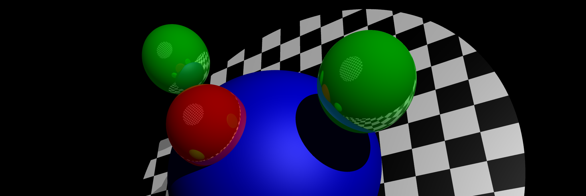

# Raytracing Engine built in Rust, runs on the web via WASM

Check out the [live demo](https://raytracer.retolucamerz.com)!

## Raytracer Package

Build the raytracer package with `cargo build` in its directory.

## Webpage

Build the .wasm files for the webpage with `wasm-pack build --release --target no-modules` in the `web` directory.
